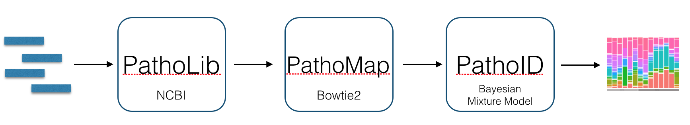
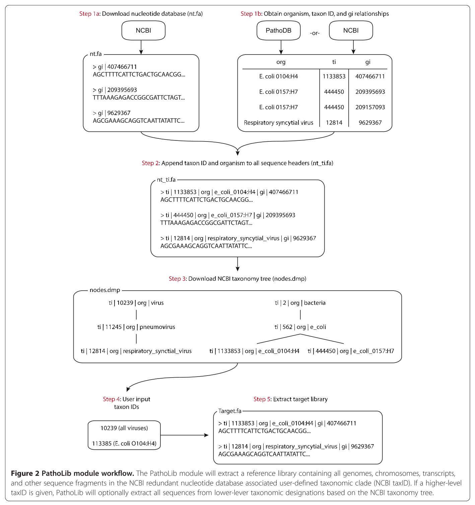

# Characterizing microbial communities using PathoScope


###### In this tutorial, we will learn how to obtain taxonomic profiles from metagenomic Next-Generation Sequencing data.

To begin, we should have installed the **_PathoSuite_** Docker image by following [these instructions](../install.md). We are going to be running various **_PathoScope_** programs by issuing commands from our Terminal to our Docker container. To make the syntax a bit easier, we can set up an alias for calling PathoScope:

```bash
alias pathosuite='docker run -ti -u rstudio -v $(pwd):/hostwd -w /hostwd --rm mlbendall/pathosuite pathoscope'
```

Now, using your alias, check that everything is working:

```bash
pathosuite --help
```
> NOTE: This alias will disappear if you exit out of the terminal, so if you log out you will need to cut-and-paste this again. 


### What PathoScope can do for you

PathoScope is a modular piece of software that will allow you to go all the way from a fastq file to a text file (typically tab-delimited) with columns representing genomes, their proportions, etc.  
There are 6 **PathoScope modules**, however, for this demo we will focus on the three most important ones:  
- **_PathoLib_** - Allows users to automatically generate custom reference genome libraries for specific scenarios or datasets  
- **_PathoMap_** - Aligns reads to target reference genome library and removes sequences that align to the filter and host libraries  
- **_PathoID_** - Reassigns ambiguous reads, identifies microbial strains present in the sample, and estimates proportions of reads from each genome  



Once you run your samples through **PathoScope**, you can easily import the output files into R for downstream exploratory data analysis and statistical inferences.  

## Reference Databases

One of the advantages of using **_PathoScope_** is the ability to easily customize reference databases. Typically, each experiment needs two different reference databases:

+ The **target** database is a collection of genomes that are closely related to the species or strains in your sample.
+ The **filter** database contains the sequences of possible contaminants, such as internal controls or host genome.

The sequences in either library can be complete genomes, draft genomes (contigs), or other types of nucleotide sequences. For our production pipelines, we typically use either NCBI's RefSeq Genomes or (recently) NCBI Reference and Representative genomes. You are free to use any sequences you like, but the key is to have a unique ID for each OTU, and all sequences belonging to each OTU should be labeled with this ID. (Later on, in PathoID, we use these identifiers in our reassignment model). We find that the NCBI Taxonomy ID is a good identifier, and we can use this in subsequent analysis to get the full lineage for an OTU.

PathoScope expects the names in the reference database to contain the unique taxonomy ID formatted like this:

> \>ti|44088|gi|40555938|ref|NC_005309.1| Canarypox virus, complete genome  

But most of the NCBI FASTA downloads look like this:

> \>gi|40555938|ref|NC_005309.1| Canarypox virus, complete genome  

There are several ways you can get the taxonomy IDs and format your file in a way **_PathoScope_** understands. We offer a pre-formatted version of the NCBI nucleotide database for download [here] (ftp://pathoscope.bumc.bu.edu/data/nt_ti.fa.gz) (25.4 GB as of Feb. 2016).

Once we have this huge file, you can use **_PathoLib_** to subsample this big file and select only the taxa that you want.

### Quick Exercise:

##### A strange virus has been infecting Blue Crabs in the Chesapeake Bay. One of our collaborators has performed a protocol to isolate and generate viral metagenome sequence libraries from infected crab gills. How can we create suitable target and filter databases for this data?

> HINT: `pathosuite LIB --help`


[](../img/patholib_workflow.png)

##### Answer:

Check out the `-taxonIds` and `-excludeTaxonIds` 

```
  -taxonIds LIB_TAXON_IDS
                        Specify taxon ids of your interest with comma
                        separated (if you have multiple taxon ids). If you do
                        not specify this option, it will work on all entries
                        in the reference file. For taxonomy id lookup, refer
                        to http://www.ncbi.nlm.nih.gov/taxonomy
  -excludeTaxonIds LIB_EXCLUDE_TAXON_IDS
                        Specify taxon ids to exclude with comma separated (if
                        you have multiple taxon ids to exclude).
```

After doing a couple of quick searches in NCBI taxonomy, we find that the taxonomy ID for all viruses is `ti:10239`.

```
pathoscope LIB -genomeFile nt_ti.fa -taxonIds 10239 --subTax -outPrefix virus
```

For the filter library, lets assume we can safely filter out any reads mapping to decapod crustacean sequences, `ti:6683`.

```
pathoscope LIB -genomeFile nt_ti.fa -taxonIds 6683 --subTax -outPrefix decapods
```

Building the reference database is usually quite time consuming, since **_PathoLib_** needs to download the NCBI taxonomy dump and go through the entire nt database.

For todays exercise I've provided pre-formatted and pre-indexed reference databases in the [`tutorial1/databases`](./databases/README.md) directory. 
The target library is a collection of microbial genomes from the reference library of the Human Microbiome Project (description [here](http://hmpdacc.org/HMREFG/)), and the filter library is simply the human genome (hg19) plus the PhiX174 phage genome that Illumina uses as internal control, which may or may not be added to the sequencing experiment.  


## PathoMap


### Getting data and reference genomes
We are going to use data from a study exploring microbiome diversity in oropharingeal swabs from schizophrenia patients and healthy controls. The SRA accession number is `SRR1519057`. 


This file is probably too big for a demo so I randomly subsampled the reads down to a more manageable size (~40 M to 40 K reads)  
* Go ahead and download the data [here](https://www.dropbox.com/s/dkfy5hcxfi7kvwq/ES_211.fastq?dl=1). If you are interested, sequences are part of [this study](https://peerj.com/articles/1140/)  
* Now you need at least two files, one to be used as target library (where your reads are going to be mapped) and another one to be used as filter library (internal controls, host genome, contaminants, etc. that you want to remove)

As target library, you can use any multi fasta file containing full or draft genomes, or even nucleotide entries from NCBI, and combinations of both. The only condition is that the fasta entries start with the taxonomy ID from NCBI as follows:

> Originally:  
\>gi|40555938|ref|NC_005309.1| Canarypox virus, complete genome  

> but PathoScope likes:  
\>ti|44088|gi|40555938|ref|NC_005309.1| Canarypox virus, complete genome  

You could do this very easily in **PathoLib**:

		python pathoscope2.py LIB -genomeFile my_file.fasta -outPrefix target_library


### Let's map the reads
Once you have your data and target and filter libraries, we are ready to go ahead with the mapping step. For this, we use bowtie2 so we will need to tell **PathoMap** where the bowtie2 indices are. If you don't have bowtie2 indices, not a problem, **PathoMap** will create them for you. And if your fasta files are larger than 4.6 GB (Bowtie2 limit), not a problem either, **PathoMap** will split your fasta files and create indices for each one of the resulting files.

If you have fasta files and not bowtie2 indices:

		python pathoscope2.py MAP -U ES_211.fastq -targetRefFiles HMP_ref_ti_0.fa,HMP_ref_ti_1.fa -filterRefFiles human.fa,phix174.fa  -outDir . -outAlign ES_211.sam  -expTag Bangladesh

But if you already have Bowtie2 indices (our case), you can issue the following command:

		python pathoscope2.py MAP -U ES_211.fastq -indexDir /Users/ecastron/Dropbox/14_workshops/Bangladesh/HMP  -targetIndexPrefixes HMP_ref_ti_0,HMP_ref_ti_1 -filterIndexPrefixes genome,phix174  -outDir . -outAlign ES_211.sam  -expTag Bangladesh

Let's give it a try...


So that should have taken ~3 minutes to run. Now you have a number of things that were printed to the screen as well as files that were created. The summary of the STDOUT is:

| Reads Mapped  | Library  | 
|:------------- | ---------------:|
| 1053      | HMP\_ref\_ti\_0 |
| 1132      | HMP\_ref\_ti\_1 |
| 916 | genome |
| 0 | phix174 |

And you should have one .sam file per library, plus another file containing the reads mapped to all target libraries, a fastq file of the reads mapping to all targets, and the file you most care about: ES_211.sam


### Let's get a taxonomic profile from our .sam file
The last step in our demo is to obtain a taxonomic profile from ES_211.sam using the read reassignment model implemented in **PathoID**

		python pathoscope2.py ID -alignFile ES_211.sam -fileType sam -outDir . -expTag DAV -thetaPrior 1000000

After running the command line above, you should get a tab-delimited file with **PathoScope's** output, and an updated .sam file representing an alignment after **PathoScope's** reassignment model was applied. The main output is the .tsv file. You can open this fle in a text editor or in Microsoft Excel.   

#### For your reference, the output generated by PathoScope in this example is [here](https://github.com/gwcbi/phylobang/tree/master/PS2_output)  

### Output TSV file format

At the top of the file in the first row, there are two fields called "Total Number of Aligned Reads" and "Total Number of Mapped Genomes". They represent the total number of reads that are aligned and the total number of genomes to which those reads align to in the given alignment file.

Columns in the TSV file:

1. **Genome:**  
This is the name of the genome found in the alignment file.
2. **Final Guess:**  
This represent the percentage of reads that are mapped to the genome in Column 1 (reads aligning to multiple genomes are assigned proportionally) after pathoscope reassignment is performed.
3. **Final Best Hit:**  
This represent the percentage of reads that are mapped to the genome in Column 1 after assigning each read uniquely to the genome with the highest score and after pathoscope reassignment is performed.
4. **Final Best Hit Read Numbers:**  
This represent the number of best hit reads that are mapped to the genome in Column 1 (may include a fraction when a read is aligned to multiple top hit genomes with the same highest score) and after pathoscope reassignment is performed.
5. **Final high confidence hits:**  
This represent the percentage of reads that are mapped to the genome in Column 1 with an alignment hit score of 50%-100% to this genome and after pathoscope reassignment is performed.
6. **Final low confidence hits:**  
This represent the percentage of reads that are mapped to the genome in Column 1 with an alignment hit score of 1%-50% to this genome and after pathoscope reassignment is performed.
7. **Initial Guess:**  
This represent the percentage of reads that are mapped to the genome in Column 1 (reads aligning to multiple genomes are assigned proportionally) before pathoscope reassignment is performed.
8. **Initial Best Hit:**  
This represent the percentage of reads that are mapped to the genome in Column 1 after assigning each read uniquely to the genome with the highest score and before pathoscope reassignment is performed.
9. **Initial Best Hit Read Numbers:**  
This represent the number of best hit reads that are mapped to the genome in Column 1 (may include a fraction when a read is aligned to multiple top hit genomes with the same highest score) and before pathoscope reassignment is performed.
10. **Initial high confidence hits:**  
This represent the percentage of reads that are mapped to the genome in Column 1 with an alignment hit score of 50%-100% to this genome and before pathoscope reassignment is performed.
11. **Initial low confidence hits:**  
This represent the percentage of reads that are mapped to the genome in Column 1 with an alignment hit score of 1%-50% to this genome and before pathoscope reassignment is performed.
