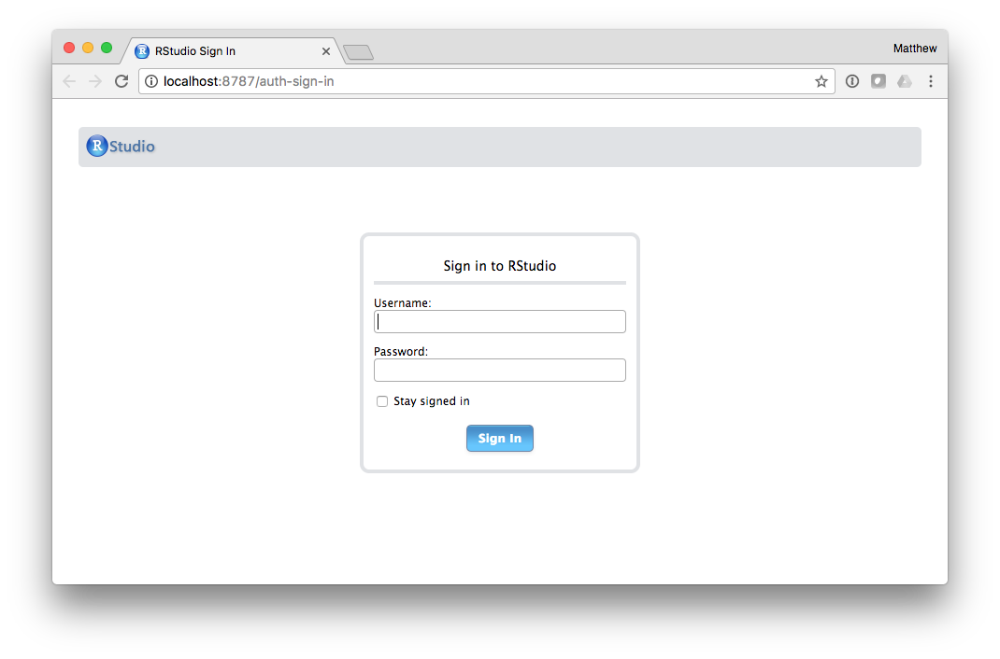
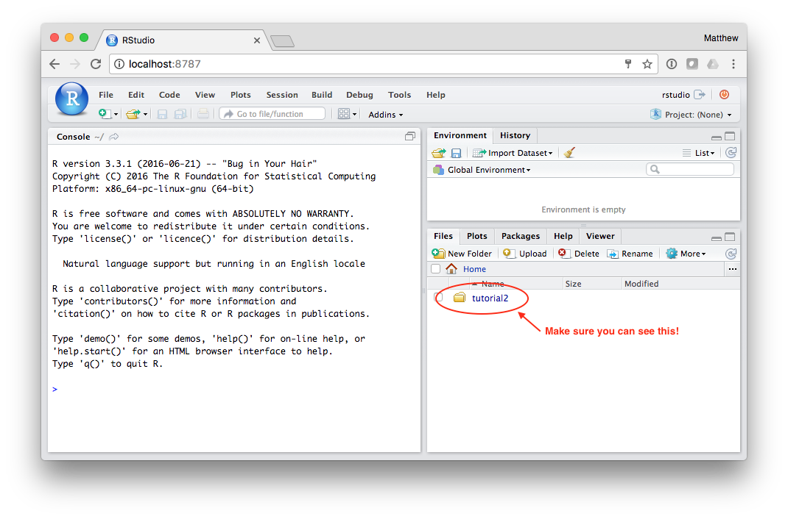
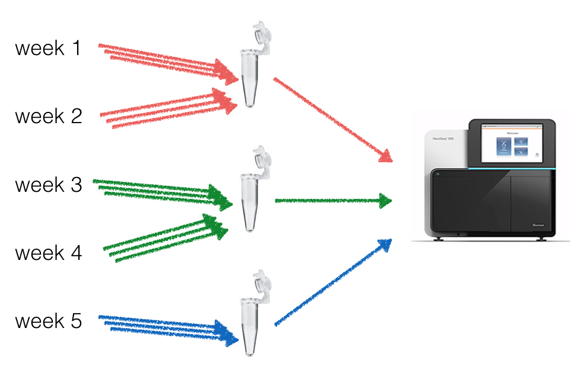
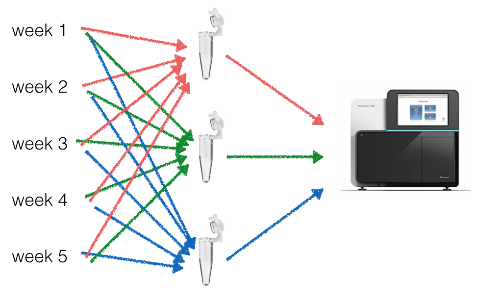

# PathoStat

## Ready for the second half?


```bash
cd /path/to/pathoscope_biogenomics2017
```

Next, we are going to use Docker to start up an Rstudio server container:

```bash
docker run -p 8787:8787 -v tutorial2:/home/rstudio/tutorial2 mlbendall/pathosuite
```

You should see something like this:

>```bash
$ docker run -p 8787:8787 -v tutorial2:/home/rstudio/tutorial2 mlbendall/pathosuite
[fix-attrs.d] applying owners & permissions fixes...
[fix-attrs.d] 00-runscripts: applying...
[fix-attrs.d] 00-runscripts: exited 0.
[fix-attrs.d] done.
[cont-init.d] executing container initialization scripts...
[cont-init.d] conf: executing...
[cont-init.d] conf: exited 0.
[cont-init.d] done.
[services.d] starting services
[services.d] done.
```

Rstudio is now running and can be accessed through your browser.

Open your browser and navigate to [`http://localhost:8787`](http://localhost:8787):




+ **username:** rstudio
+ **password:** rstudio




See [this](../install.md) if you are installing PathoStat outside of Docker.


## Exercise 1: Batch effects

In this first exercise we are going to learn how to recognize batch effects and how to
control for them.

In your R console, load the `BatchQC` package

```
library(BatchQC)
```

Learn about the features of [batch QC](https://github.com/mani2012/BatchQC)

```r
browseVignettes("BatchQC")
vignette('BatchQCIntro', package='BatchQC')
vignette('BatchQC_examples', package='BatchQC')
vignette('BatchQC_usage_advanced', package='BatchQC')
```

### Experiment

In this exercise, we are going to analyze the (simulated) data from a metagenomic timeseries experiment. Researchers collected samples for 5 weeks 

```r

```

Load the count matrix from the first experiment into _BatchQC_ like this:

```r
load("tutorial2/exercise1.Rdata")
```

Go ahead and check out what the data looks like.

Now load the data into BatchQC:

```r
batchQC(counts.ts1, samps.ts1$batch, condition=samps.ts1$cond)
```

Take a few minutes to explore this data in BatchQC...


```r
batchQC(counts.ts2, samps.ts2$batch, condition=samps.ts2$cond)
```








```r
library(PathoStat)


```


For the final part of this workshop, we need some pieces of software installed in our machines:  

* [R](https://www.r-project.org) and [RStudio](https://www.rstudio.com/products/rstudio/download/) (Latest versions, all free)
* [Bioconductor](http://www.bioconductor.org/install/)
* [PathoStat](http://www.bioconductor.org/packages/release/bioc/html/PathoStat.html)

In this part, we will use PathoStat to explore the taxonomic profiles of 10 metagenomic samples from two individuals obtained over five time points (weeks).  
These samples come from two individuals, one of which became infected with a gut bacteria that after treatment got healthy again. The idea here is that using PathoStat you guess which individual is infected. Download PathoScope's output files from [here](https://github.com/gwcbi/phylobang/blob/master/tsv.zip?raw=true).  

Let's run PathoStat. From the R console type:  
	
		setwd("~/Directory/tsv")

where `~/Directory/tsv` is the path to the directory where the provided PathoScope output is located (you have to unzip the downloaded file). Then, with only two lines of code you can execute PathoStat:  

First, creating a PathoStat object  

		pstat <- createPathoStat(input_dir=".", sample_data_file="sample_data.tsv")
And then, executing the GUI with that object preloaded  
		
		runPathoStat(pstat)
You should see something like:  


The data is time-structured so you can explore the change in microbiome abundances over time. In this case, we have five time points (week) so let's go to the Time Series tab and select 'Time', 'genus', and all taxa but others. You should see something like:  


Since we are using a GUI, you can explore the program options by clicking on the tabs on top and selecting settings from the left-hand panel.

#### Remember that you need to find what is infecting Subject H1!  

This activity concludes our workshop. You probably feel that you have lots of questions and you can contact us at [eduardo.castro@unab.cl](mailto:eduardo.castro@unab.cl) and [kcrandall@gwu.edu](mailto:kcrandall@gwu.edu).  
  
    
     
     

